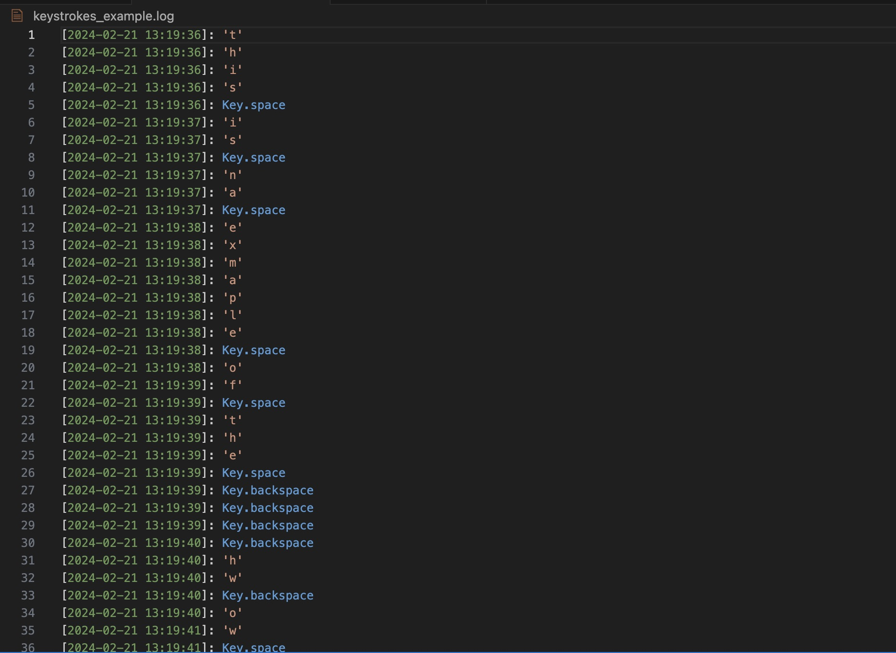

# Usage
## Requirements
- `Python v3.12.0`
- `pynput==1.7.6`
## Running
The logger can be started from the command line using
```bash
python kb_logger.py
```
This will default the output to `keystrokes.log`, to set a custom output path use either of the below commands
```bash
python kb_logger.py -o [output_file_path]
```
```bash
python kb_logger.py --output [output_file_path]
```
The program will continue running until the user types 'q' into the command line which will quit.

Full example with output:
```bash
python kb_logger.py
The logger is running. The keystrokes are being logged to 'keystrokes.log'
Press "q" to quit:
```
On Successful exit:
```sh
The logger has been stopped. The keystrokes have been logged to 'keystrokes.log' since 2024-02-21 13:19:35
```
This will result in a file similar to the one seen below
# Output


